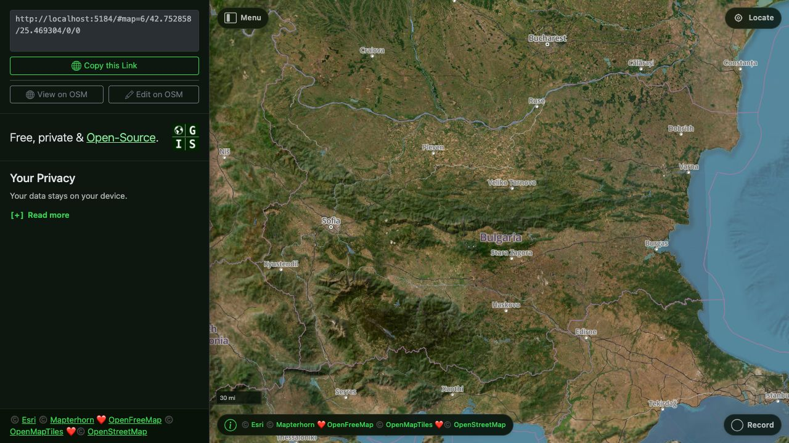
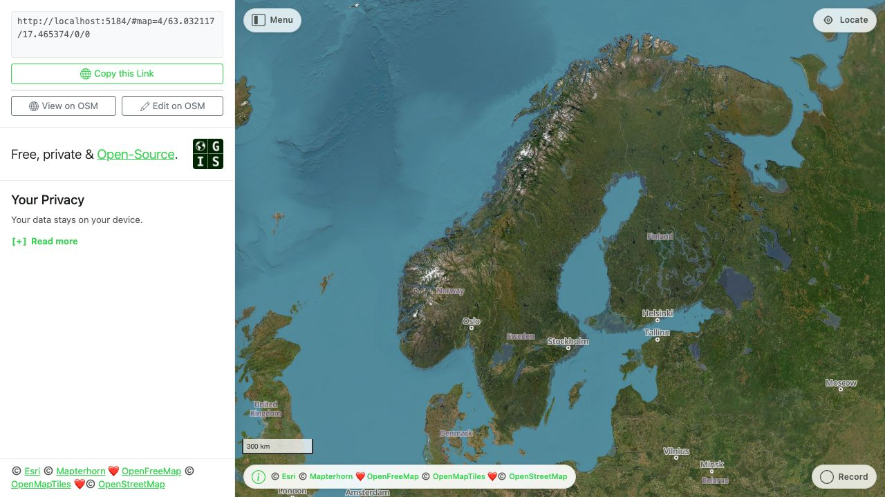

[ogis.app](https://www.ogis.app/?country=random)

> A navigational tool to rule them all, right in the browser.

No API keys, no registration, no app stores and no invasions of privacy.

A _loveletter_ to the [OpenStreetMap](https://www.openstreetmap.org/) ecosystem ❤️ Special thanks to [OpenFreeMap](https://openfreemap.org/) for tile hosting.

> [!NOTE]
> The app is currently in **SPA front-end only mode** — the account, maps and collections features (which require a backend) are disabled in the UI.

## Screenshots





## Features

- Detailed, free global map — no install, no account
- Globe view on first load
- Corner controls for menu, locate and record, plus a merged Info panel (share links, app info, privacy)
- GPS locate with compass heading
- Record GPS tracks and export as GPX
- Import GPX routes and navigate offline
- Download map regions for offline use (via a service worker)
- Multilingual — follows your device language
- Shareable camera views
- Map view persisted between sessions
- Light and dark mode, following your device setting
- Works on any device

> [!NOTE]
> **Offline maps** — drag a region on the map to download its tiles and glyphs for offline use. A hand-rolled service worker (`public/sw.js`) caches the app shell and map resources; see [docs/12.offline.md](docs/12.offline.md).

## Drawbacks and Limitations

- Location permissions are required for GPS/Compass features. Some users have a deny-all approach to browser permissions and changing them varies between browsers and devices.
- The app does not work in the background or when the device is locked — a common limitation of web apps.
- The app requires an initial connection to load assets and map tiles, even though it works offline thereafter.

## Planned Changes

- Much more language support
- Better handling of denied location permissions

## Thanks Open Source!

| Component          | Source                                                                                                            |
| ------------------ | ----------------------------------------------------------------------------------------------------------------- |
| **Map Data**       | &copy; [OpenStreetMap contributors](https://www.openstreetmap.org/copyright)                                      |
| **Tile Hosting**   | [OpenFreeMap](https://openfreemap.org)                                                                            |
| **Rendering**      | [MapLibre GL JS](https://maplibre.org/)                                                                           |
| **Tile Schema**    | [OpenMapTiles](https://www.openmaptiles.org/) / [OSM Bright](https://github.com/openmaptiles/osm-bright-gl-style) |
| **User Interface** | [Vue JS](https://vuejs.org/) / [Bootstrap](https://getbootstrap.com/)                                             |
| **Icons**          | [OpenGIS icons](https://github.com/OpenGIS/icons) / [Bootstrap Icons](https://github.com/twbs/icons)              |

## Development

### Install

```bash
npm install
```

### Build

```bash
npm run build
```

### Icons

Icon sources are vendored in `src/icons/` alongside the committed generated bundle.

```bash
npm run icons:build   # regenerate the bundle after adding or updating source icons
```

See [docs/14.icons.md](docs/14.icons.md) for the pipeline.

### Local

Set the backend API origin for cross-subdomain auth/API calls:

> [!NOTE]
> Only needed when the auth/backend features are re-enabled — the app currently runs in SPA front-end only mode.

```bash
echo "VITE_API_BASE_URL=https://api.example.com" > .env.local
```

```bash
npm run dev
```

### Testing

```bash
# Unit
npm test    # unit tests (vitest; needs Node 24)

# E2E
npx playwright install chromium
npm run test:e2e -- tests/e2e/{spec}.spec.js
npm run test:e2e
npm run test:matrix   # screenshot matrix only (fast local; temp output)
```

Screenshot captures run in a dedicated, always-SwiftShader Playwright project. A plain local run is unpinned and parallel, and writes the matrix to a gitignored temp directory, so it never touches the committed PNGs; re-baseline them explicitly with `npm run test:matrix:update`, and GitHub's `Screenshots` workflow reproduces the committed bytes in its macOS capture shards and verifies the full matrix in an aggregate check. The `DARK.jpg`/`LIGHT.jpg` heroes are the deliberate exception — intentionally non-deterministic live captures that a full-suite run refreshes in place every time. See [docs/9.testing.md](docs/9.testing.md) for the testing strategy.

## Contributing

Please use [Conventional Commits](https://www.conventionalcommits.org/en/v1.0.0/).

CI's semantic-release job derives versions, changelogs and GitHub releases from commit messages, so a message that does not parse is invisible to the release process.

Format: `<type>(optional scope): <description>`, e.g. `fix(offline): purge stale tile URLs`.

| Type       | Use for                                              |
| ---------- | ---------------------------------------------------- |
| `feat`     | A new feature (minor release)                        |
| `fix`      | A bug fix (patch release)                            |
| `perf`     | A performance improvement (patch release)            |
| `refactor` | A change that neither fixes a bug nor adds a feature |
| `docs`     | Documentation only                                   |
| `test`     | Tests only                                           |
| `ci`       | CI configuration and scripts                         |
| `chore`    | Maintenance that does not fit the above              |
| `build`    | Build system or dependencies                         |

Breaking changes use `!` after the type/scope (`feat(api)!: …`) or a `BREAKING CHANGE:` footer, and trigger a major release. See `docs/13.ci.md` for the full release flow.

## Docs

See [docs/README.md](docs/README.md) for the full developer documentation.
