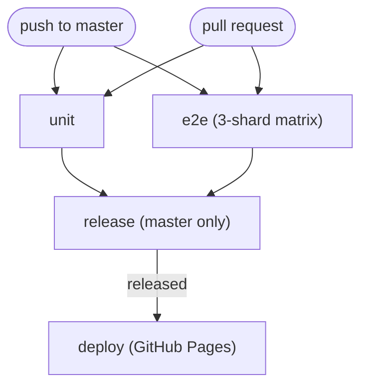

# CI — tests, releases and deployment

GitHub Actions runs the test suites, cuts releases with semantic-release, and deploys to GitHub Pages. Everything lives in a single workflow: [`.github/workflows/ci.yml`](../.github/workflows/ci.yml).

---

## Triggers and jobs

The workflow runs on every push to `master` and every pull request. `unit` and `e2e` run in parallel; `release` and `deploy` only run for `master` pushes.



| Job       | Runs on                               | What it does                                                                                                                                                                 |
| --------- | ------------------------------------- | ---------------------------------------------------------------------------------------------------------------------------------------------------------------------------- |
| `unit`    | Every push and PR                     | `npm ci`, a Prettier format check (`npm run format:check`), then `npm test` (Vitest) with `CI=1`                                                                             |
| `e2e`     | Every push and PR                     | Installs Chromium (`--with-deps`), runs the full suite as a 3-shard matrix (`--shard=N/3`, `CI=1`), uploads per-shard artefacts even on failure. 60-minute timeout per shard |
| `release` | `master` pushes, after `unit` + `e2e` | `npx semantic-release` with `GITHUB_TOKEN`; exposes a `released` output                                                                                                      |
| `deploy`  | Only when `released == true`          | Builds `dist/`, uploads the Pages artefact and deploys to GitHub Pages                                                                                                       |

- The `e2e` job is a three-shard matrix with `fail-fast: false`; each shard runs `npm run test:e2e -- --shard=N/3` with `CI=1`, so CI uses SwiftShader software rendering, serial workers and two retries. Shards are balanced by test count (35 tests each) and disjoint; the screenshot matrix (`ui-states.spec.js`) falls entirely within shard 3.
- Default workflow permissions are `contents: read`. `release` escalates to `contents: write`, `issues: write` and `pull-requests: write`; `deploy` needs `pages: write` and `id-token: write`.
- Concurrency is grouped per ref (`ci-${{ github.ref }}`) and cancels in-progress runs for pull requests only.
- `deploy` checks out `master` after the release and passes `VITE_API_BASE_URL` from the repository's Actions variables into `npm run build`.

### Why release and deploy share one workflow

`GITHUB_TOKEN`-created pushes do not trigger further workflows. semantic-release pushes a version commit and a tag back to `master`; a separate deploy workflow listening for that push would never run. Keeping release and deploy in the same run side-steps this. The release commit message also carries `[skip ci]`, so that push does not re-trigger CI.

---

## Artefacts

Each of the three `e2e` shards uploads its own artefact — `e2e-artefacts-shard-1`, `e2e-artefacts-shard-2` and `e2e-artefacts-shard-3` — with `if: always()` so they are available for failed runs too. Each contains:

| Path                 | Contents                                                                                       |
| -------------------- | ---------------------------------------------------------------------------------------------- |
| `playwright-report/` | The HTML report — first stop for a red e2e run                                                 |
| `screenshots/`       | The screenshot matrix as regenerated by that shard (see [Testing](./8.testing.md#screenshots)) |

Download the relevant shard from the **Artifacts** section of a workflow run. Retention is 14 days. `if-no-files-found: ignore` means a run with no screenshots does not fail the upload step.

> [!NOTE]
> CI regenerates and uploads screenshots but does not commit them back. The committed JPEGs under `screenshots/` come from local runs.

---

## Conventional commits are required

All commit messages must follow the [Conventional Commits](https://www.conventionalcommits.org/en/v1.0.0/) specification — semantic-release parses them to decide the next version and build the release notes. A message that does not parse is invisible to the release process.

Format: `<type>(optional scope): <description>`

| Type       | Use for                                              | Release impact |
| ---------- | ---------------------------------------------------- | -------------- |
| `feat`     | A new feature                                        | Minor          |
| `fix`      | A bug fix                                            | Patch          |
| `perf`     | A performance improvement                            | Patch          |
| `refactor` | A change that neither fixes a bug nor adds a feature | None           |
| `docs`     | Documentation only                                   | None           |
| `test`     | Tests only                                           | None           |
| `ci`       | CI configuration and scripts                         | None           |
| `chore`    | Maintenance that does not fit the above              | None           |
| `build`    | Build system or dependencies                         | None           |

Breaking changes use `!` after the type/scope (`feat(api)!: …`) or a `BREAKING CHANGE:` footer, and trigger a major release.

```
feat(offline): add region drawer
fix(sw): purge dev caches on startup
docs(testing): describe the screenshot matrix
ci: upload e2e artefacts
feat(locate)!: rename the locate API

BREAKING CHANGE: locate events now emit { position } instead of { lat, lng }.
```

---

## Releases with semantic-release

[`.releaserc.json`](../.releaserc.json) configures semantic-release on the `master` branch:

| Plugin                                      | Purpose                                                                                                              |
| ------------------------------------------- | -------------------------------------------------------------------------------------------------------------------- |
| `@semantic-release/commit-analyzer`         | Determines the release type from commit messages                                                                     |
| `@semantic-release/release-notes-generator` | Builds the release notes                                                                                             |
| `@semantic-release/changelog`               | Writes `CHANGELOG.md`                                                                                                |
| `@semantic-release/npm`                     | Bumps `package.json` / `package-lock.json` (`npmPublish: false` — nothing is published to npm)                       |
| `@semantic-release/github`                  | Creates the GitHub release and tag                                                                                   |
| `@semantic-release/git`                     | Commits `CHANGELOG.md`, `package.json` and `package-lock.json` back to `master` as `chore(release): X.Y.Z [skip ci]` |

The `release` job snapshots `HEAD` before and after `npx semantic-release`; if it moved, the `released` output is `true` and `deploy` runs. If no commit since the last tag warrants a release, nothing is released and `deploy` is skipped.

> [!IMPORTANT]
> **Baseline tag.** The first automated release must start from **3.3.0**. semantic-release uses the latest tag as its starting point — with no tag present it would start from 1.0.0 — so a `v3.3.0` tag must be pushed to `master` before the workflow's first release run. Joe pushes this tag manually; agents never run git write operations.

---

## Running the same checks locally

```bash
npm test                                      # unit — what the unit job runs
npm run format:check                          # Prettier check — the unit job's format step
npm run format                                # rewrite files with Prettier
npm run test:e2e -- --workers=4               # full e2e suite, parallel (local GPU rendering)
npm run test:e2e -- tests/e2e/core.spec.js    # single spec
E2E_SWIFTSHADER=1 npm run test:e2e -- --workers=2  # reproduce CI's SwiftShader rendering
CI=1 npm run test:e2e                         # closest to CI (see below)
```

- Locally, E2E defaults to the full Chromium build with GPU rendering; run the full suite with `--workers=4` (fast and stable). SwiftShader is the CI renderer — see [Testing — E2E rendering modes](./8.testing.md#e2e-rendering-modes).
- Prettier runs with defaults across JS, Vue, SCSS, YAML and Markdown; [`.prettierignore`](../.prettierignore) excludes generated output.
- `CI=1` flips the switches in [`playwright.config.js`](../playwright.config.js): `workers: 1`, `retries: 2`, `forbidOnly`, `reuseExistingServer: false` and SwiftShader rendering, so Playwright starts its own dev server on port 5184. `E2E_SWIFTSHADER=1` selects only the renderer, preserving local parallel workers.
- Screenshot specs only, via the `@screenshots` tag: `npm run test:e2e -- --grep @screenshots`
- Single spec: `npm run test:e2e -- tests/e2e/core.spec.js`

### Service worker in E2E (`VITE_SW=1`)

The Playwright webServer starts Vite with `VITE_SW: "1"` ([`playwright.config.js:93`](../playwright.config.js#L93)), opting the test app into the app-shell service worker. This keeps the e2e run on the closest dev equivalent to production, and [`tests/e2e/sw.spec.js`](../tests/e2e/sw.spec.js) asserts the worker registers on load and that a reload boots cleanly while it is in control.

A normal `npm run dev` does **not** register the worker — it unregisters any existing one and clears the origin's caches instead, so profiles poisoned by an earlier dev registration self-heal. `VITE_SW=1` is the explicit opt-in. See [Offline — registration and gating](./10.offline.md#registration-and-gating) for the full behaviour and why.

---

## Related

- [Testing](./8.testing.md) — unit and E2E conventions, screenshot matrix
- [Offline](./10.offline.md) — service worker caches, registration gating
- [`README.md`](../README.md) — how to run the suites

[← Offline](./10.offline.md) | [Docs Index](./README.md)
