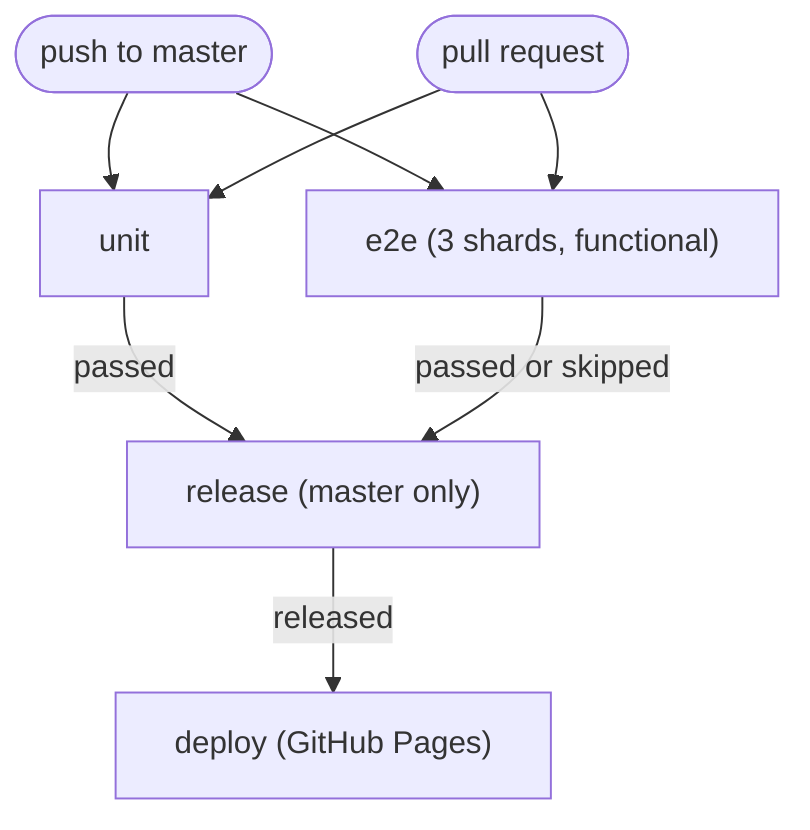

# CI — tests, releases and deployment

GitHub Actions runs the test suites, cuts releases with semantic-release, and deploys to GitHub Pages. Everything lives in a single workflow: [`.github/workflows/ci.yml`](../.github/workflows/ci.yml).

---

## Triggers and jobs

The workflow runs on every push to `master` and every pull request. `unit` and `e2e` run in parallel; `release` and `deploy` only run for `master` pushes, and a push can skip `e2e` with the [skip marker](#skipping-the-e2e-shards).



| Job       | Runs on                                  | What it does                                                                                                                                                                                                             |
| --------- | ---------------------------------------- | ------------------------------------------------------------------------------------------------------------------------------------------------------------------------------------------------------------------------ |
| `unit`    | Every push and PR                        | `npm ci`, a Prettier format check (`npm run format:check`), then `npm test` (Vitest) with `CI=1`                                                                                                                         |
| `e2e`     | Every push and PR (skippable on push)    | Installs Chromium (`--with-deps`), runs the functional suite as a 3-shard matrix (`--grep-invert @screenshots --shard=N/3`, `CI=1`), uploads per-shard `playwright-report/` even on failure. 30-minute timeout per shard |
| `release` | `master` pushes; `e2e` passed or skipped | `npx semantic-release` with `GITHUB_TOKEN`; exposes a `released` output                                                                                                                                                  |
| `deploy`  | Only when `released == true`             | Builds `dist/`, uploads the Pages artefact and deploys to GitHub Pages                                                                                                                                                   |

- The `e2e` job is a three-shard matrix with `fail-fast: false`; each shard runs `npm run test:e2e -- --grep-invert @screenshots --shard=N/3` with `CI=1`, so CI uses SwiftShader software rendering, serial workers and two retries. The `@screenshots` matrix specs are excluded and run in the local full suite instead (see [Testing — Screenshots](./9.testing.md#screenshots)). Functional shards are expected to complete in single-digit minutes (measured at ~8 min before the screenshot exclusion), and each has a 30-minute timeout.
- The `e2e` job has no live map-asset dependency: the shared test fixture serves the MapLibre style, sprites and glyphs from the committed fixtures under `tests/e2e/fixtures/map/`, unvendored tiles/glyphs default to an instant empty 200, and the context-level stub blocks any other external request, so no shard fetches a live map origin. Refreshing those fixtures (`npm run fixtures:refresh`) is a manual local step and deliberately not part of CI — see [Testing — Map-asset fixtures](./9.testing.md#map-asset-fixtures).
- Default workflow permissions are `contents: read`. `release` escalates to `contents: write`, `issues: write` and `pull-requests: write`; `deploy` needs `pages: write` and `id-token: write`.
- A push can skip the three functional shards with a marker in its head commit message — see [Skipping the e2e shards](#skipping-the-e2e-shards).
- Concurrency is grouped per ref (`ci-${{ github.ref }}`) and cancels in-progress runs for pull requests only.
- `deploy` checks out `master` after the release and passes `VITE_API_BASE_URL` from the repository's Actions variables into `npm run build`.

> [!NOTE]
> Why the screenshot matrix is excluded from CI: GitHub runners render with SwiftShader, where each capture costs ~50–60 s versus ~15 s locally, and the full matrix would consume ~60–75 minutes of runner CPU. Visual verification runs on the development machine as the final-verification step instead.

### Skipping the e2e shards

A push whose **head commit message** contains the marker `[skip e2e]` skips all three functional shards — useful for docs- or metadata-only changes. The match is case-insensitive and covers the whole message (subject and body); it applies to pushes only, so pull requests always run `e2e`. `unit` still runs, and `release` proceeds on a deliberate skip but is still blocked by an `e2e` failure — and never runs on a cancelled workflow.

> [!WARNING]
> Any commit message containing the marker string triggers the skip — including one that merely quotes it. Paraphrase it when writing commit messages; the literal text is only safe in tracked files such as this document, because only commit messages are matched.

### Why release and deploy share one workflow

`GITHUB_TOKEN`-created pushes do not trigger further workflows. semantic-release pushes a version commit and a tag back to `master`; a separate deploy workflow listening for that push would never run. Keeping release and deploy in the same run side-steps this. The release commit message also carries `[skip ci]`, so that push does not re-trigger CI.

---

## Artefacts

Each of the three `e2e` shards uploads its own artefact — `e2e-artefacts-shard-1`, `e2e-artefacts-shard-2` and `e2e-artefacts-shard-3` — with `if: always()` so they are available for failed runs too. Each contains:

| Path                 | Contents                                       |
| -------------------- | ---------------------------------------------- |
| `playwright-report/` | The HTML report — first stop for a red e2e run |

Download the relevant shard from the **Artifacts** section of a workflow run. Retention is 14 days. `if-no-files-found: ignore` means a run that produced no report does not fail the upload step.

> [!NOTE]
> The screenshot matrix is not part of CI. The committed JPEGs under `screenshots/` come from local runs; see [Testing — Screenshots](./9.testing.md#screenshots).

---

## Conventional commits are required

All commit messages must follow the [Conventional Commits](https://www.conventionalcommits.org/en/v1.0.0/) specification — semantic-release parses them to decide the next version and build the release notes. A message that does not parse is invisible to the release process.

Format: `<type>(optional scope): <description>`

| Type       | Use for                                              | Release impact |
| ---------- | ---------------------------------------------------- | -------------- |
| `feat`     | A new feature                                        | Minor          |
| `fix`      | A bug fix                                            | Patch          |
| `perf`     | A performance improvement                            | Patch          |
| `refactor` | A change that neither fixes a bug nor adds a feature | None           |
| `docs`     | Documentation only                                   | None           |
| `test`     | Tests only                                           | None           |
| `ci`       | CI configuration and scripts                         | None           |
| `chore`    | Maintenance that does not fit the above              | None           |
| `build`    | Build system or dependencies                         | None           |

Breaking changes use `!` after the type/scope (`feat(api)!: …`) or a `BREAKING CHANGE:` footer, and trigger a major release.

```
feat(offline): add region drawer
fix(sw): purge dev caches on startup
docs(testing): describe the screenshot matrix
ci: upload e2e artefacts
feat(locate)!: rename the locate API

BREAKING CHANGE: locate events now emit { position } instead of { lat, lng }.
```

---

## Releases with semantic-release

[`.releaserc.json`](../.releaserc.json) configures semantic-release on the `master` branch:

| Plugin                                      | Purpose                                                                                                              |
| ------------------------------------------- | -------------------------------------------------------------------------------------------------------------------- |
| `@semantic-release/commit-analyzer`         | Determines the release type from commit messages                                                                     |
| `@semantic-release/release-notes-generator` | Builds the release notes                                                                                             |
| `@semantic-release/changelog`               | Writes `CHANGELOG.md`                                                                                                |
| `@semantic-release/npm`                     | Bumps `package.json` / `package-lock.json` (`npmPublish: false` — nothing is published to npm)                       |
| `@semantic-release/github`                  | Creates the GitHub release and tag                                                                                   |
| `@semantic-release/git`                     | Commits `CHANGELOG.md`, `package.json` and `package-lock.json` back to `master` as `chore(release): X.Y.Z [skip ci]` |

The `release` job snapshots `HEAD` before and after `npx semantic-release`; if it moved, the `released` output is `true` and `deploy` runs. If no commit since the last tag warrants a release, nothing is released and `deploy` is skipped.

> [!NOTE]
> semantic-release resolves the GitHub repository from `repository.url` in [`package.json`](../package.json) — currently `https://github.com/OpenGIS/app.git`. Keep it in sync when the repository is renamed: a stale URL blocks releases.

---

## Running the same checks locally

```bash
npm test                                      # unit — what the unit job runs
npm run format:check                          # Prettier check — the unit job's format step
npm run format                                # rewrite files with Prettier
npm run test:e2e -- --workers=4               # full e2e suite incl. screenshots — local final verification
npm run test:e2e -- --grep-invert @screenshots --shard=1/3  # one CI shard's functional tests
npm run test:e2e -- tests/e2e/core.spec.js    # single spec
E2E_SWIFTSHADER=1 npm run test:e2e -- --workers=2  # reproduce CI's SwiftShader rendering
CI=1 npm run test:e2e -- --grep-invert @screenshots --shard=1/3  # exactly how CI runs a shard
```

- Locally, E2E defaults to the full Chromium build with GPU rendering; run the full suite with `--workers=4` (fast and stable). This is the final verification before declaring a task complete — it includes the `@screenshots` matrix and regenerates the committed `screenshots/` artefacts. CI runs the functional suite only. SwiftShader is the CI renderer — see [Testing — E2E rendering modes](./9.testing.md#e2e-rendering-modes).
- Prettier runs with defaults across JS, Vue, SCSS, YAML and Markdown; [`.prettierignore`](../.prettierignore) excludes generated and vendored output (including `tests/e2e/fixtures/`).
- `CI=1` flips the switches in [`playwright.config.js`](../playwright.config.js): `workers: 1`, `retries: 2`, `forbidOnly`, `reuseExistingServer: false` and SwiftShader rendering, so Playwright starts its own dev server on port 5184. `E2E_SWIFTSHADER=1` selects only the renderer, preserving local parallel workers.
- Screenshot specs only, via the `@screenshots` tag (local runs; excluded from CI): `npm run test:e2e -- --grep @screenshots`
- Single spec: `npm run test:e2e -- tests/e2e/core.spec.js`

### Service worker in E2E (`VITE_SW=1`)

The Playwright webServer starts Vite with `VITE_SW: "1"` ([`playwright.config.js:96`](../playwright.config.js#L96)), opting the test app into the app-shell service worker. This keeps the e2e run on the closest dev equivalent to production, and [`tests/e2e/sw.spec.js`](../tests/e2e/sw.spec.js) asserts the worker registers on load and that a reload boots cleanly while it is in control.

A normal `npm run dev` does **not** register the worker — it unregisters any existing one and clears the origin's caches instead, so profiles poisoned by an earlier dev registration self-heal. `VITE_SW=1` is the explicit opt-in. See [Offline — registration and gating](./12.offline.md#registration-and-gating) for the full behaviour and why.

---

## Related

- [Testing](./9.testing.md) — unit and E2E conventions, screenshot matrix
- [Offline](./12.offline.md) — service worker caches, registration gating
- [`README.md`](../README.md) — how to run the suites

[← Offline](./12.offline.md) | [Docs Index](./README.md)
